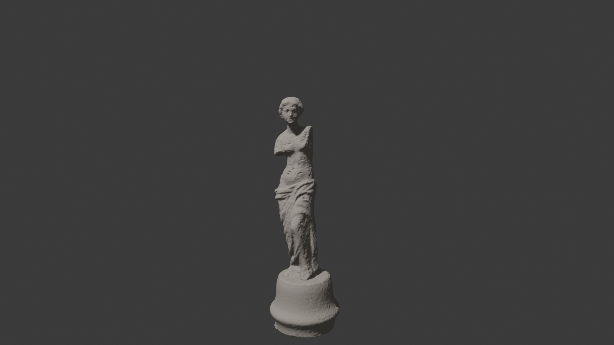

# Venus_De_Milo_Photogrammetry

A heritage sculpture digitized using **photogrammetry** and deployed as a **web-based interactive 3D and mobile AR experience**.

## Overview

This project documents the full pipeline of transforming a physical family-owned Venus de Milo replica into a real-time 3D model viewable in the browser and placeable in real space using mobile AR.

The workflow covers **data capture, reconstruction, optimization, web deployment, and AR presentation**, following best practices for scale accuracy and performance.

## Pipeline Summary

1. **Image Capture**

   * 250+ high-resolution photographs
   * Multi-ring coverage (low / mid / high angles)
   * Controlled lighting, consistent exposure
   * Dataset cleaning and selection before processing

2. **Photogrammetry**

   * Processed with **Meshroom (AliceVision)**
   * Object-focused photogrammetry pipeline
   * Dense reconstruction and texture generation

3. **Post-Processing**

   * Mesh cleanup and optimization in Blender
   * Correct real-world scale (≈ 30 cm height)
   * Lighting, color, and material tuning
   * All transforms applied before export

4. **Export & Formats**

   * `.glb` for web and Android AR
   * `.usdz` for iOS AR (Quick Look)
   * Optimized for real-time rendering

5. **Web & AR Deployment**

   * Interactive 360° inspection via `<model-viewer>`
   * Mobile AR placement (floor-based, real-scale)
   * Hosted using GitHub Pages + Netlify CDN
   * CORS-safe asset delivery for external model loading

## Features

* Real-time 3D rotation and zoom
* Accurate real-world AR scale
* Mobile AR support (iOS & Android)
* Lightweight, CDN-hosted assets
* Clean, minimal gallery UI

## Technologies Used

* Meshroom (Photogrammetry)
* Blender (Post-processing & optimization)
* GLTF / GLB / USDZ
* `<model-viewer>`
* GitHub Pages
* Netlify (CDN & asset hosting)

## Why This Project Matters

This project demonstrates:

* End-to-end 3D digitization skills
* Practical photogrammetry knowledge
* Real-time web 3D and AR deployment
* Attention to scale, realism, and performance
* Ability to turn raw data into a polished, user-facing product

## Live Demo

-> https://hikmetemre.github.io/Venus_De_Milo_Photogrammetry/

## Author

**Hikmet Emre Güler**
Data Scientist / System Professional
GitHub: [https://github.com/HikmetEmre](https://github.com/HikmetEmre)

Say which one and I’ll tailor it.
